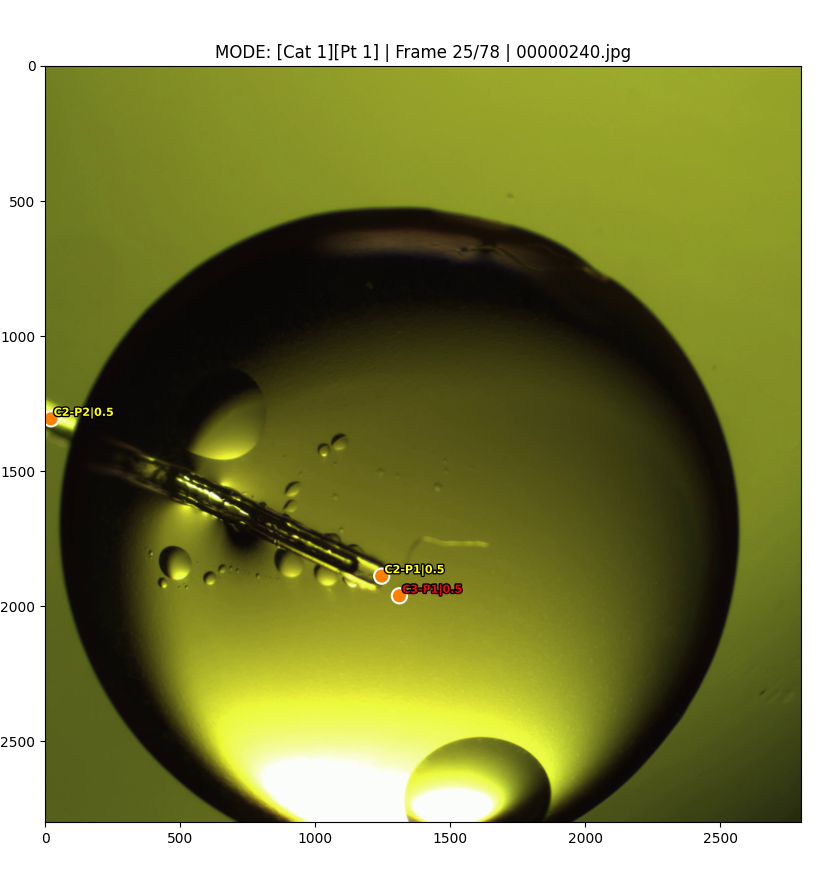
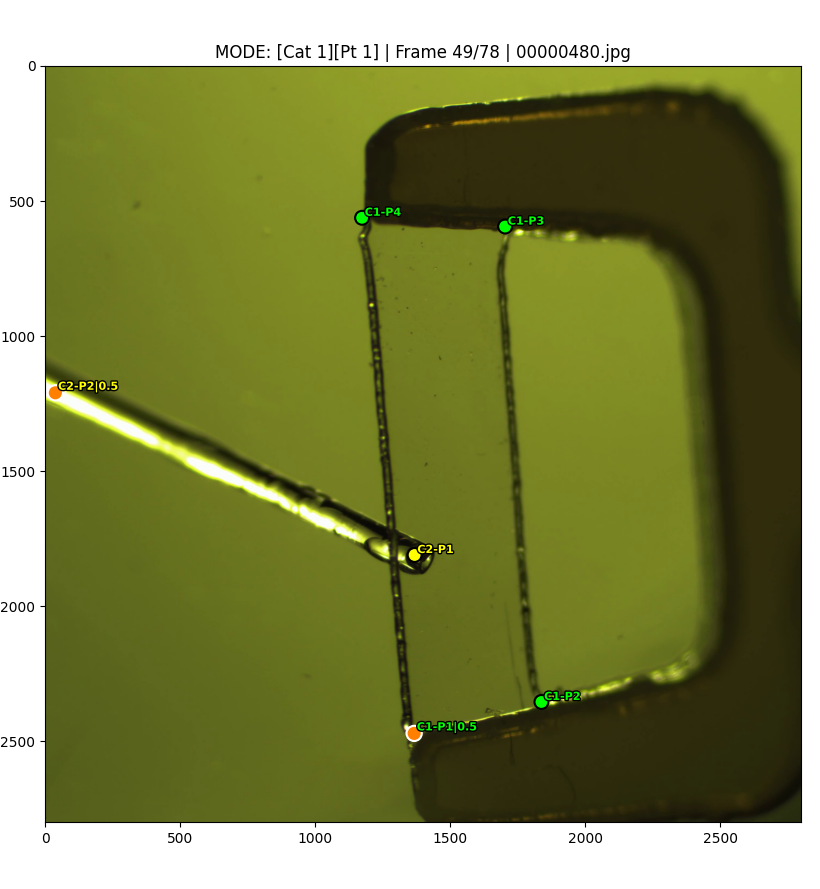

# Simple Annotation KPT

This tool is a lightweight, no-AI version of the annotation pipeline.

It supports:
- `extract`: open a video (or image folder), split/export frames, and initialize dataset files.
- `review`: open a GUI to edit keypoints (frame navigation, add/delete/move points, category/point-id selection, save).

## Outputs

For input `<name>`, outputs are written to:
- `outputs/<name>/images/*`
- `outputs/<name>/center_points_masks_annotations.json`
- `outputs/<name>/keypoints.json`

The JSON structure is kept compatible with `auto_annotation_pipeline`.

## Desktop GUI (Windows)

Run without arguments to open the folder picker:

```powershell
python E:\simple_annotation_kpt\main.py
```

Choose an input image folder (or video), an output root folder, and a frame step.
The result directory is displayed as `<output root>/<input name>`.
Click **Extract** first. **Start annotation** and **Open result folder** remain
inactive until the result contains images and both valid annotation JSON files.
Extraction runs in the background and the launcher displays its log.
Existing result folders are protected against extraction overwriting annotations.
To resume, select the same input and output root and click **Start annotation**.

The Python environment needs `opencv-python`, `numpy`, `matplotlib`, and Tkinter.
The command-line commands below remain available.

## Usage

### 1) Extract dataset (no AI)

```bash
python -u simple_annotation_kpt/main.py extract \
  --input /path/to/video_or_image_folder \
  --output outputs \
  --frame-step 1
```

### 2) Review keypoints

```bash
python -u simple_annotation_kpt/main.py review outputs/<name>
```

## Reviewer Controls

- `Q`: quit
- `A` / `D`: previous / next frame
- `S`: save `keypoints.json`
- `1-5`: set category
- `Z/X/C/V`: set point id to `1/2/3/4`
- `Left click`: select point and drag to move
- `Ctrl + Left click`: add point using current category and point id, then clear selection.
- **Auto next keypoint** (enabled by default): after adding a point, keep the category
  unchanged and advance point id `1 -> 2 -> 3 -> 4 -> 1`. Turn it off to add multiple
  points with the same point id, such as cells.
- `Right click`: delete nearest point

## Annotation Guidelines




Please follow these rules when annotating:

- Tool tip: use `Category 2 - Point 1`.
- Tool root/base: use `Category 2 - Point 2`.
- Racket: use `Category 1`.
- For the racket, label the four points from the top-left corner in counterclockwise order as `0, 1, 2, 3`.
- The model may swap pairs `0/1` and `2/3`, so occasional swapped annotations are acceptable.
- Cells: use `Category 3 - Point 1`, and multiple points are allowed.
